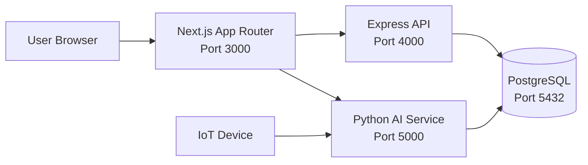
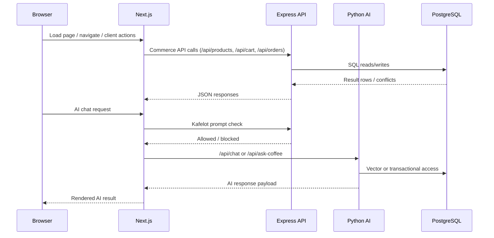
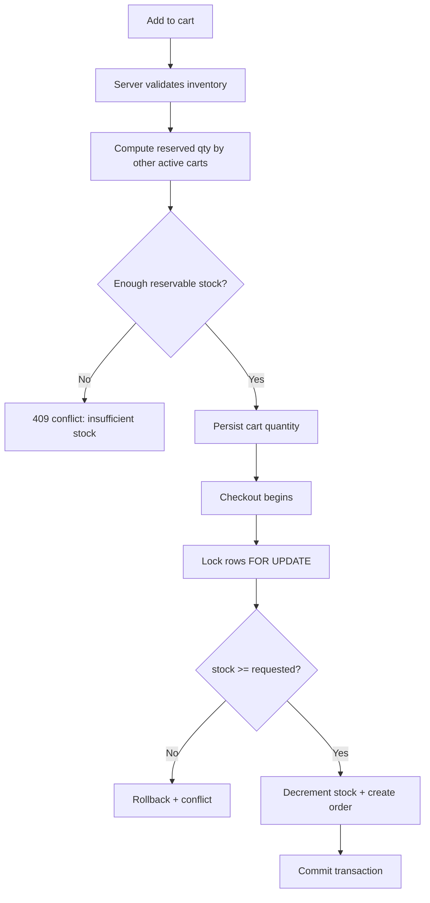
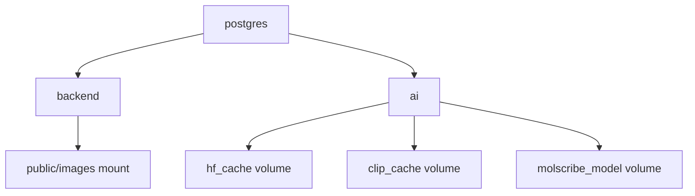

# Filspresso Next

Filspresso Next is a full-stack coffee commerce platform that combines e-commerce, AI assistance, and IoT-ready machine orchestration.

It is built with Next.js (App Router), Express, PostgreSQL, and a Python AI service (Flask + Tanka model stack).

## Quick Start For New Contributors (5 Minutes)

If you are new to this repository, use this section first.

### 1) Prerequisites

- Node.js 20+
- npm 10+
- Docker Desktop (recommended)
- Python 3.10+ (only required if you run AI service outside Docker)

### 2) Clone and install frontend dependencies

```bash
git clone https://github.com/DarkShadow1107/filspresso_next.git
cd filspresso_next
npm install
```

### 3) Start backend services with Docker

```bash
docker compose up --build -d postgres backend ai
```

### 4) Run the Next.js frontend

```bash
npm run dev
```

### 5) Open the app

- Frontend: http://localhost:3000
- Express API health: http://localhost:4000/health
- Python AI health: http://localhost:5000/api/health

### Quick verification checklist

- `docker compose ps` shows `postgres`, `backend`, and `ai` as running
- `GET /health` on port 4000 returns status ok
- `GET /api/health` on port 5000 returns status ok
- Home page loads at port 3000 and can navigate between pages

---

## Table Of Contents

- [1. Product Overview](#1-product-overview)
- [2. Architecture At A Glance](#2-architecture-at-a-glance)
- [3. Technology Stack](#3-technology-stack)
- [4. Monorepo Structure](#4-monorepo-structure)
- [5. Runtime Topology And Ports](#5-runtime-topology-and-ports)
- [6. Environment Variables](#6-environment-variables)
- [7. Local Development Workflows](#7-local-development-workflows)
- [8. Docker Involvement (Deep Dive)](#8-docker-involvement-deep-dive)
- [9. Frontend Architecture](#9-frontend-architecture)
- [10. Backend Architecture (Express)](#10-backend-architecture-express)
- [11. AI Service Architecture (Python)](#11-ai-service-architecture-python)
- [12. API Surface Reference](#12-api-surface-reference)
- [13. Database Model And Data Lifecycle](#13-database-model-and-data-lifecycle)
- [14. Stock Integrity, Reservation, And Checkout Safety](#14-stock-integrity-reservation-and-checkout-safety)
- [15. Security Model](#15-security-model)
- [16. Observability, Health, And Incidents](#16-observability-health-and-incidents)
- [17. Page Map And Route Behavior](#17-page-map-and-route-behavior)
- [18. Screenshots (All Pages)](#18-screenshots-all-pages)
- [19. Testing, Validation, And Quality Gates](#19-testing-validation-and-quality-gates)
- [20. Deployment Guide](#20-deployment-guide)
- [21. Troubleshooting Playbook](#21-troubleshooting-playbook)
- [22. Contributor Guidelines](#22-contributor-guidelines)
- [23. Operational Runbook](#23-operational-runbook)
- [24. Known Gaps And Suggested Next Improvements](#24-known-gaps-and-suggested-next-improvements)
- [25. Image Assets And Media Pipeline](#25-image-assets-and-media-pipeline)
- [Appendix A. Command Reference](#appendix-a-command-reference)
- [Appendix B. Important Files](#appendix-b-important-files)
- [Appendix C. Source File Index (Snapshot)](#appendix-c-source-file-index-snapshot)

---

## 1. Product Overview

Filspresso Next delivers a unified product experience around coffee discovery and purchase:

- Commerce experiences for coffee capsules, machines, favorites, cart, payments, and account
- Multi-service backend architecture with explicit health and incident tracking
- AI assistant flows for text and image-assisted coffee guidance
- IoT command pipeline for machine command scheduling and status feedback
- Docker-first environment for local onboarding and reproducible runtime

### Primary goals

- Reliable shopping and order flows
- Correct stock behavior under concurrent usage
- Modern frontend with App Router and route rewrites
- High developer velocity with clear service boundaries

---

## 2. Architecture At A Glance

### System context diagram



### Request routing and service interactions



### Stock-safe checkout flow



---

## 3. Technology Stack

### Frontend

- Next.js 16 (App Router, standalone output)
- React 19
- TypeScript 5
- Tailwind CSS 4
- Motion library for UI animation
- ESLint 9 with next config

### Backend (Commerce API)

- Node.js 20+ runtime
- Express 4.18
- PostgreSQL access via pg
- Security and middleware: helmet, cors, jsonwebtoken, bcrypt, express-rate-limit, multer

### AI backend

- Python 3.10+
- Flask 3 with Flask-CORS
- sentence-transformers, transformers, faiss-cpu
- torch + torchvision
- Molecule pipeline support: rdkit, py3Dmol, chembl-webresource-client, MolScribe dependency set

### Models used in this app

| Model                                     | Family / package      | Where used                              | Purpose                                                          |
| ----------------------------------------- | --------------------- | --------------------------------------- | ---------------------------------------------------------------- |
| all-MiniLM-L6-v2                          | sentence-transformers | `models/tanka.py` natural_language mode | Embedding generation for semantic retrieval over `coffee_facts`  |
| fine_tuned_minilm (optional local path)   | sentence-transformers | `models/fine_tuned_minilm` if present   | Preferred domain-tuned embedding model override                  |
| CLIP ViT-B/32                             | openai/CLIP           | `models/tanka.py` `describe_image()`    | Image understanding/classification for chat image uploads        |
| MolScribe (`swin_base_char_aux_200k.pth`) | molscribe             | `models/tanka.py` chemistry mode        | Molecule structure recognition from images and SMILES extraction |

Model behavior is lazy-loaded at runtime. This keeps startup time lower and only loads models when endpoints actually require them.

### Data and infra

- PostgreSQL 16
- pgvector and rdkit enabled by DB image setup
- Docker Compose orchestration with health checks and named volumes

---

## 4. Monorepo Structure

```text
.
|- .vscode/
|  |- settings.json
|- docs/
|  |- SCREENSHOTS.md
|  |- screenshots/
|- express-api/
|  |- .env
|  |- package.json
|  |- server.js
|  |- data/
|  |  |- extensions.sql
|  |  |- schema.sql
|  |- db/
|  |  |- connection.js
|  |- middleware/
|  |  |- auth.js
|  |- routes/
|  |  |- accounts.js
|  |  |- admin.js
|  |  |- auth.js
|  |  |- cards.js
|  |  |- cart.js
|  |  |- chat.js
|  |  |- favorites.js
|  |  |- kafelot.js
|  |  |- orders.js
|  |  |- products.js
|  |  |- repairs.js
|  |  |- subscriptions.js
|  |  |- weather.js
|  |- scripts/
|  |  |- check_db_status.js
|  |  |- debug_account_dates.js
|  |  |- diagnostic_columns.js
|  |  |- fix_schema.js
|  |  |- run_migration.js
|  |  |- setup_all_tables.js
|  |  |- setup_favorites_table.js
|  |  |- setup_full_db.js
|  |  |- test_login.js
|  |  |- update_admin_creds.js
|  |- utils/
|     |- dockerManager.js
|     |- encryption.js
|     |- ensureAppSchema.js
|- logs/
|- models/
|  |- __init__.py
|  |- requirements.txt
|  |- tanka.py
|  |- data/
|  |  |- capsule_volumes.json
|  |  |- chembl-molecules.json
|  |  |- coffee_chunks.json
|  |- model/
|     |- swin_base_char_aux_200k.pth
|- public/
|  |- data/
|  |  |- chembl-molecules.json
|  |- fonts/
|  |- images/
|  |  |- Capsules/
|  |  |  |- Original/
|  |  |  |- Vertuo/
|  |  |- Machines/
|  |  |  |- Original/
|  |  |  |- Vertuo/
|  |  |- Payment/
|  |  |- icons/
|  |  |- svg/
|- scripts/
|  |- addCoffeeNotes.mjs
|  |- extractCoffeeData.mjs
|  |- extractMachinesData.mjs
|  |- remove_render_graph.py
|  |- replace_sections.py
|  |- start_all.bat
|  |- esp32/
|     |- esp32_coffeemachine.ino
|- src/
|  |- app/
|  |  |- globals.css
|  |  |- layout.tsx
|  |  |- page.tsx
|  |  |- admin/page.tsx
|  |  |- favorites/page.tsx
|  |  |- kafelot-privacy/page.tsx
|  |  |- manage-subscription/
|  |  |  |- layout.tsx
|  |  |  |- page.tsx
|  |  |- payment/
|  |  |  |- layout.tsx
|  |  |  |- page.tsx
|  |  |- privacy-policy/page.tsx
|  |  |- sales-refunds/page.tsx
|  |  |- services/page.tsx
|  |  |- terms-of-use/page.tsx
|  |  |- api/
|  |     |- chat/route.ts
|  |     |- chat/save/route.ts
|  |     |- model/route.ts
|  |     |- pages/
|  |     |- python-chat/route.ts
|  |     |- python-health/route.ts
|  |     |- services-health/route.ts
|  |     |- subscribe/route.ts
|  |- components/
|  |  |- account/
|  |  |- coffee/
|  |  |- coffee-machine-animation/
|  |  |- favorites/
|  |  |- home/
|  |  |- kafelot/
|  |  |- legal/
|  |  |- love-coffee/
|  |  |- machines/
|  |  |- payment/
|  |  |- services/
|  |  |- shopping-bag/
|  |  |- subscription/
|  |  |- AccountIconGenerator.tsx
|  |  |- Cart.tsx
|  |  |- CoffeeRecommender.tsx
|  |  |- FavoritesProvider.tsx
|  |  |- LayoutChrome.tsx
|  |  |- MoleculeVisualizer.tsx
|  |  |- Navbar.tsx
|  |  |- NotificationsProvider.tsx
|  |  |- PaymentForm.tsx
|  |  |- ScrollToTopButton.tsx
|  |  |- SubscriptionForm.tsx
|  |  |- WeatherWidget.tsx
|  |- data/
|  |  |- chat_history.json
|  |  |- coffee.generated.json
|  |  |- coffee.ts
|  |  |- machines.generated.json
|  |  |- machines.ts
|  |- hooks/
|  |  |- useCart.ts
|  |  |- useCoffeeCollections.ts
|  |  |- useMachineCollections.ts
|  |- icons/
|  |- lib/
|  |- styles/
|  |- types/
|- .dockerignore
|- .env
|- .gitignore
|- app.py
|- docker-compose.yml
|- Dockerfile.ai
|- Dockerfile.db
|- Dockerfile.express
|- eslint.config.mjs
|- filspresso_next.code-workspace
|- FilspressoNext.session.sql
|- global.d.ts
|- iot_db.py
|- LICENSE
|- next-env.d.ts
|- next.config.ts
|- package.json
|- postcss.config.mjs
|- proxy.ts
|- README.md
|- requirements.txt
|- seed_vectors.py
|- tailwind.config.cjs
|- train.py
|- tsconfig.json
```

Notes:

- This structure intentionally excludes generated and dependency-heavy folders such as `.next`, `node_modules`, and virtual environments.
- The source tree under `src/icons` is large (hundreds of icon files) and is represented as a directory node to keep this README maintainable.

---

## 5. Runtime Topology And Ports

| Service     | Port | Responsibility                            | Health Endpoint              |
| ----------- | ---- | ----------------------------------------- | ---------------------------- |
| Next.js     | 3000 | UI rendering, route handlers, proxy logic | n/a (application page load)  |
| Express API | 4000 | Commerce/auth/cart/orders/products/admin  | /health and /health/services |
| Python AI   | 5000 | AI chat/semantic search/IoT endpoints     | /api/health                  |
| PostgreSQL  | 5432 | Transactional + vector/chemistry data     | pg_isready health check      |

### Internal container addressing

Inside Docker network:

- backend reaches db at host `postgres`
- backend reaches AI at `http://ai:5000`
- AI reaches db at host `postgres`

Outside Docker (host machine):

- frontend usually calls Express via `http://localhost:4000`
- Next route handlers proxy to AI via configured `PYTHON_AI_HOST`

---

## 6. Environment Variables

### Frontend / Next

| Variable                       | Typical Value         | Purpose                                      |
| ------------------------------ | --------------------- | -------------------------------------------- |
| NEXT_PUBLIC_API_URL            | http://localhost:4000 | Base URL used by frontend calls              |
| PYTHON_AI_HOST                 | http://localhost:5000 | Next handler upstream for AI proxy           |
| NEXT_PUBLIC_AI_URL             | optional              | Alternate client AI URL if used              |
| SERVICE_METRICS_STRICT_DB_ONLY | false                 | Controls strict mode in service health route |

### Express

| Variable                          | Typical Value         | Purpose                             |
| --------------------------------- | --------------------- | ----------------------------------- |
| PORT                              | 4000                  | Express listening port              |
| DB_HOST                           | postgres or localhost | PostgreSQL host                     |
| DB_PORT                           | 5432                  | PostgreSQL port                     |
| DB_NAME                           | filspresso            | DB name                             |
| DB_USER                           | filspresso_user       | DB user                             |
| DB_PASSWORD                       | secret                | DB password                         |
| JWT_SECRET                        | secret                | JWT signing                         |
| ENCRYPTION_KEY                    | secret                | encryption helper key               |
| CORS_ORIGIN                       | http://localhost:3000 | Allowed origin list                 |
| PYTHON_AI_HOST                    | http://ai:5000        | AI health and integration host      |
| DISABLE_RATE_LIMIT_FOR_DEV        | true or false         | dev toggle                          |
| DISABLE_RATE_LIMIT                | true or false         | explicit global rate-limiter toggle |
| CART_RESERVATION_MINUTES          | 20                    | cart reservation contention window  |
| CART_STOCK_BUFFER_UNITS           | 0                     | optional safety buffer              |
| SERVICE_INCIDENT_RETENTION_DAYS   | 180                   | incident retention window           |
| SERVICE_INCIDENT_RETENTION_JOB_MS | 21600000              | cleanup job interval                |

### Python AI

| Variable       | Typical Value         | Purpose         |
| -------------- | --------------------- | --------------- |
| PYTHON_AI_PORT | 5000                  | Flask bind port |
| DB_HOST        | postgres or localhost | PostgreSQL host |
| DB_PORT        | 5432                  | PostgreSQL port |
| DB_NAME        | filspresso            | DB name         |
| DB_USER        | filspresso_user       | DB user         |
| DB_PASSWORD    | secret                | DB password     |

---

## 7. Local Development Workflows

### Workflow A: Docker for backend services + local frontend

1. Run `docker compose up --build -d postgres backend ai`
2. Run `npm install` and `npm run dev` in repository root
3. Access app at port 3000

### Workflow B: Fully local (no Docker for app services)

1. Ensure PostgreSQL is locally available and configured
2. Start Express from express-api directory: `npm install && npm run dev`
3. Create Python virtual environment and run app.py
4. Start Next dev server from root

### Workflow C: Windows helper script

`scripts/start_all.bat` does:

- compose up detached
- starts frontend dev server

---

## 8. Docker Involvement (Deep Dive)

Docker is not an optional side note in this project. It is part of how the architecture is intended to run locally and in production-like environments.

### Compose services

- postgres
    - Built from Dockerfile.db
    - Mounts schema/extensions SQL for initialization
    - Exposes port 5432
    - Health check via pg_isready

- backend
    - Built from Dockerfile.express
    - Depends on healthy postgres
    - Exposes port 4000
    - Mounts public images volume for admin media workflows
    - Health check via /health

- ai
    - Built from Dockerfile.ai
    - Depends on healthy postgres
    - Exposes port 5000
    - Uses persistent caches for HuggingFace, CLIP, and MolScribe model artifacts
    - Health check via /api/health

### Compose dependency graph



### Important volumes

- postgres_data: persists relational data
- hf_cache: transformer model cache
- clip_cache: CLIP model cache
- molscribe_model: molecule model assets

### Typical Docker commands

```bash
docker compose up --build -d
docker compose ps
docker compose logs -f backend
docker compose logs -f ai
docker compose down
```

---

## 9. Frontend Architecture

### Routing model

The frontend uses a page-slug pattern where root page resolves component based on query param:

- root path `/` with `?page=<slug>` loads appropriate page module
- rewrite logic in proxy.ts maps pretty paths (`/coffee`, `/machines`, `/account`, etc.) to root with page param
- bypass list protects `/api`, static assets, Next internals, and robots/sitemap

### Page composition pattern

- shared providers for notifications/cart/favorites
- hook-driven client data sync with Express endpoints
- feature components under src/components with domain segmentation

### Data flow

1. Component invokes hook
2. Hook calls Express API or Next route handler
3. State updated from authoritative backend response
4. UI reflects stock, cart totals, favorites, and account state

---

## 10. Backend Architecture (Express)

### Startup responsibilities

- load environment variables
- enforce security middleware
- apply CORS policy with localhost allowlist
- optionally apply global rate limiting
- verify schema compatibility via ensureAppSchema
- expose health and incident endpoints
- mount feature route modules under /api

### Mounted route groups

- /api/auth
- /api/accounts
- /api/cards
- /api/orders
- /api/cart
- /api/chat
- /api/weather
- /api/subscriptions
- /api/repairs
- /api/admin
- /api/products
- /api/favorites
- /api/kafelot

### Operational endpoints

- GET /health
- GET /health/services
- GET /health/services/events
- POST /health/services/events/bulk

---

## 11. AI Service Architecture (Python)

### Service profile

Flask app that exposes semantic Q and A, multimodal chat, and IoT command lifecycle helpers.

### Runtime model loading behavior

- Natural language mode loads MiniLM embeddings model (`all-MiniLM-L6-v2` or local fine-tuned variant if available).
- Image input path loads CLIP ViT-B/32 to score semantic image labels.
- Chemistry mode with image loads MolScribe (`models/model/swin_base_char_aux_200k.pth`) to extract molecule SMILES.
- Models are loaded lazily (first-use load), then reused in memory.

### Core endpoint behavior

- POST /api/ask-coffee
    - Embeds query
    - Runs pgvector similarity query over coffee facts
    - Returns top contextual facts

- POST /api/chat
    - Accepts JSON or multipart
    - Supports modes: natural_language and chemistry
    - Optional image path runs CLIP or MolScribe-related handling

- GET /api/health
    - Basic service health payload

### AI mode behavior summary

| Mode             | Input        | Primary behavior                         |
| ---------------- | ------------ | ---------------------------------------- |
| natural_language | text         | semantic retrieval + contextual response |
| natural_language | image + text | CLIP-style image description path        |
| chemistry        | image + text | molecule extraction/recognition path     |
| chemistry        | text only    | prompts for molecule image upload        |

---

## 12. API Surface Reference

### Next route handlers

- POST /api/python-chat
- DELETE /api/python-chat?request_id=...
- GET /api/python-health
- GET /api/services-health
- GET /api/model
- POST /api/chat
- GET|POST /api/chat/save
- POST /api/subscribe

### Express functional domains

- Auth and account management
- Product catalog and stock
- Cart operations
- Order creation and history
- Favorites
- Subscriptions
- Weather and repairs
- Admin operations
- Prompt/quota flow with kafelot route group

### API expectations

- JSON response envelopes for normal and error outcomes
- explicit conflict errors for stock failures
- no optimistic success assumptions in frontend behavior

---

## 13. Database Model And Data Lifecycle

Schema source is primarily in express-api/data/schema.sql and supporting migration/bootstrap scripts in express-api/scripts and utils.

### Main data domains

- Accounts and authentication: accounts, user_sessions
- Payment method data: user_cards
- Catalog/inventory: coffee_products, machine_products
- Purchasing: cart_items, orders, order_items
- Personalization: favorites, subscriptions, user_subscriptions
- AI memory/data: coffee_facts, molecules, chat_sessions, chat_messages
- IoT operations: iot_commands
- Operational records: service health incident tables and weather cache

### Data lifecycle

- startup schema checks reduce drift
- cart/order flows enforce transactional updates
- historical records retained for analytics and audit

---

## 14. Stock Integrity, Reservation, And Checkout Safety

This application is designed to avoid overselling.

### Layer 1: cart-time validation

- each add/update checks product stock
- reservation impact from other active carts is considered
- optional configured buffer is subtracted
- if unavailable, API returns conflict and does not mutate cart

### Layer 2: checkout-time transactional guard

- row locks with FOR UPDATE
- guarded decrement where stock must remain non-negative
- transaction rolls back on violation
- user receives deterministic conflict response

### Why both layers matter

- cart validation reduces bad UX early
- checkout lock guarantees data consistency under concurrency

---

## 15. Security Model

Implemented safeguards include:

- helmet security headers
- origin-controlled CORS strategy
- request rate limiting with clear development toggles
- JWT support for authenticated routes
- password hashing with bcrypt

Recommended production hardening:

- strict secret rotation policy
- transport-level TLS termination
- route-specific rate limits on auth/checkout
- centralized secret manager
- audit logging and anomaly alerts

---

## 16. Observability, Health, And Incidents

### Multi-service health

Express exposes health state for:

- backend
- database
- ai
- administration

### Incident retention

- retention window controlled by SERVICE_INCIDENT_RETENTION_DAYS
- cleanup interval controlled by SERVICE_INCIDENT_RETENTION_JOB_MS

### Frontend behavior during outages

Next route handlers can provide degraded but explicit service status, helping user-facing pages remain informative.

---

## 17. Page Map And Route Behavior

### Core page slugs resolved by root page

- home
- love-coffee
- coffee
- machines
- subscription
- shopping-bag
- favorites
- account
- payment
- coffee-machine-animation

### Additional route pages in app directory

- /admin
- /favorites
- /payment
- /manage-subscription
- /services
- /privacy-policy
- /terms-of-use
- /sales-refunds
- /kafelot-privacy

### Proxy rewrite concept

Pretty URLs are mapped into page slug query values so the app keeps a centralized rendering shell while preserving navigable URLs.

---

## 18. Screenshots (All Pages)

This section documents every PNG currently in `docs/screenshots`, including what each image represents and the features visible in the UI.

### Screenshot location

- docs/screenshots

### Complete gallery with explanations

#### Home (`home.png`)


Main landing experience with hero messaging, primary navigation entry points, and featured commerce sections.

- Highlights onboarding flow into coffee and machine discovery.
- Shows the visual tone and top-level call-to-action hierarchy.

#### Coffee Catalog (`coffee.png`)


Core coffee listing page where users browse capsule products by collection and flavor profile.

- Product cards expose name, imagery, and purchase actions.
- Serves as the primary entry to capsule detail and cart flows.

#### Coffee Types (`coffee_types.png`)


Coffee taxonomy view focused on type segmentation and browse refinement.

- Emphasizes category discovery across coffee families.
- Supports faster filtering before adding products to cart.

#### Capsule Amount (`capsule_amount.png`)


Quantity/pack-size focused UI used to communicate capsule volume options and selection controls.

- Helps users understand purchase quantity context before checkout.
- Reinforces price/volume decisions in product journey.

#### Machines (`machines.png`)


Machine catalog page for browsing available coffee machine models.

- Presents machine cards with model visuals and selection actions.
- Connects hardware discovery with commerce and account features.

#### Account Machines (`account_machines.png`)


Account-area machine management surface that links user profile context with owned/registered machines.

- Centralizes machine-related actions under the account domain.
- Supports post-purchase hardware lifecycle management.

#### Favorites (`favorites.png`)


Favorites page where users keep a personal shortlist of products for quick return.

- Enables save-for-later behavior and repeat purchase patterns.
- Integrates with card/grid shopping actions.

#### Shopping Bag (`shopping_bag.png`)


Cart interface summarizing selected items and quantities before payment.

- Displays line items and checkout progression controls.
- Acts as validation checkpoint for quantity and selection updates.

#### Payment (`payment_page.png`)


Checkout payment page responsible for final transaction information entry and order confirmation path.

- Hosts payment form UI and order total context.
- Final step in commerce conversion funnel.

#### Orders (`orders.png`)


Order history/status interface for reviewing previously placed purchases.

- Surfaces transactional timeline and order tracking visibility.
- Supports support/debug workflows for account-specific purchases.

#### Subscription (`subscription.png`)


Subscription product setup view for recurring coffee delivery management.

- Shows plan configuration controls and recurring options.
- Enables retention-focused purchasing model.

#### Subscription Account (`subscription_account.png`)


Account-specific subscription management area for updating active recurring plans.

- Provides self-service controls over cadence and subscription state.
- Complements the initial subscription enrollment flow.

#### Management Account (`management_account.png`)


Account management dashboard area for identity/profile-related actions.

- Consolidates user-level controls in one administrative panel.
- Acts as a hub for profile and membership interactions.

#### Member Status 1 (`member_status_1.png`)


Membership status state capture showing one phase of user membership information.

- Communicates loyalty/member tier context.
- Supports account personalization and feature gating.

#### Member Status 2 (`member_status_2.png`)


Second membership state capture to document alternate membership status presentation.

- Shows conditional UI behavior for different account states.
- Useful for validating membership lifecycle transitions.

#### Spending Analytics (`spending_analytics.png`)


User analytics screen focused on spending trends and account-level purchase metrics.

- Visualizes financial behavior for informed subscription/purchase decisions.
- Useful for retention and engagement feature storytelling.

#### Graphs (`graphs.png`)


Data visualization surface showing charted metrics linked to account or admin intelligence.

- Demonstrates chart components and insight-focused UI.
- Supports analytical product capabilities documentation.

#### Admin (`admin_page.png`)


Administrative dashboard for privileged operations and system-level oversight.

- Includes management controls unavailable to normal users.
- Central point for operational and moderation workflows.

#### Services (`services.png`)


Services landing page describing customer support or platform service offerings.

- Captures non-commerce navigation branch of the app.
- Supports informational and support journey continuity.

#### Maintenance (`maintenance.png`)


Maintenance/support operations view centered on machine upkeep and serviceability context.

- Documents after-sales support pathways.
- Relates to hardware lifecycle and service scheduling.

#### Warranty Repair (`warranty_repair.png`)


Warranty and repair-specific page for service requests and policy-aligned remediation.

- Highlights support request flow for malfunction scenarios.
- Strengthens trust and post-purchase support documentation.

#### Kafelot (`kafelot.png`)


AI assistant experience where users interact with coffee guidance and intelligent suggestions.

- Demonstrates conversational AI surface in product ecosystem.
- Connects recommendation workflow with broader shopping experience.

#### Kafelot Privacy (`kafelot_policy.png`)


Privacy disclosure page specific to Kafelot AI interactions and data handling boundaries.

- Clarifies AI-specific privacy promises and usage constraints.
- Supports compliance and user transparency.

#### Privacy Policy (`privacy_policy.png`)


Global privacy policy page describing data collection, processing, and retention posture.

- Legal transparency for platform-wide data practices.
- Core trust and compliance documentation endpoint.

#### Terms Of Use (`terms_of_use.png`)


Legal terms page covering usage conditions and service boundaries.

- Defines contractual framework for using platform features.
- Complements policy and refund/legal navigation pages.

#### Sales And Refunds (`sales_and_refunds.png`)


Commercial policy page documenting sales conditions, returns, and refund expectations.

- Sets user expectations for post-purchase outcomes.
- Reduces support ambiguity in order dispute scenarios.

### Optional automation for screenshot capture

You can automate capture with Playwright/Cypress in CI and export to docs/screenshots using route-by-route scripts.

### Screenshot quality and consistency guidance

- Capture each page in both desktop and mobile breakpoints where possible.
- Keep browser UI (tabs/address bar) outside the image frame.
- Use PNG for UI fidelity, especially where text overlays gradients.
- Keep naming consistent with `docs/SCREENSHOTS.md` so gallery links remain valid.
- Prefer deterministic captures after data is loaded (avoid intermediate loading states).

---

## 19. Testing, Validation, And Quality Gates

### Frontend checks

```bash
npm run lint
npm run build
```

### Express checks

```bash
cd express-api
npm install
npm run dev
```

### Python checks

```bash
python -m venv .venv
# Windows
.venv\Scripts\activate
pip install -r requirements.txt
pip install -r models/requirements.txt
python app.py
```

### Recommended test expansion

- API contract tests for route payload stability
- integration race-condition tests for stock reservation and checkout
- E2E tests for cart/account/payment flows
- snapshot coverage for legal and policy pages

---

## 20. Deployment Guide

### Production topology

- Next.js web service/container
- Express API service/container
- Python AI service/container
- PostgreSQL managed DB or HA cluster
- reverse proxy and TLS termination

### Deployment sequence

1. Provision database and extensions
2. Deploy Express and confirm /health
3. Deploy Python AI and confirm /api/health
4. Deploy Next.js and verify frontend integration
5. Execute smoke flows: login, browse, cart, checkout, AI chat

### Release checklist

- environment variables verified
- migrations/bootstrap validated
- health checks green
- rollback path prepared
- backup snapshot taken before schema-impacting release

---

## 21. Troubleshooting Playbook

### Frontend cannot fetch backend

- verify NEXT_PUBLIC_API_URL
- verify backend container status
- verify CORS_ORIGIN allows current host/port

### AI route fails from frontend

- verify PYTHON_AI_HOST
- check ai container logs
- check model cache volume permissions

### Stock conflict errors in cart

- expected when request exceeds reservable stock
- inspect reservation window and stock buffer settings
- ensure variant IDs are canonical and not cross-mapped

### Docker stack unhealthy

- run docker compose ps
- inspect specific service logs
- verify DB credentials and dependency ordering

### start_all script exits with code 1

- run docker compose command directly and inspect output
- run npm run dev manually to isolate frontend startup issue
- ensure no conflicting process already occupies port 3000

---

## 22. Contributor Guidelines

### Branching

- create feature branch from active integration branch
- keep commits scoped and reviewable
- include migration notes if schema behavior changes

### Coding standards

- preserve API compatibility whenever possible
- avoid optimistic UI messages when backend operation failed
- keep security middleware enabled except intentional local diagnostics
- write explicit and stable error payloads for frontend consumers

### Documentation standards

- update this README when adding services, route groups, env vars, or operational behavior
- update screenshot section when UI pages materially change

---

## 23. Operational Runbook

### Daily operations

- verify service health endpoints
- monitor incident event volume
- inspect cart/order conflict trends for stock tuning

### Weekly operations

- review service incident retention status
- verify backup restore path
- refresh dependency security scans

### Incident response outline

1. detect via health endpoint degradation
2. identify failing service and upstream dependency
3. apply rollback or restart strategy
4. verify functional smoke tests
5. document postmortem and preventive fixes

---

## 24. Known Gaps And Suggested Next Improvements

- Add OpenAPI specs for Express and Python APIs
- Add route-level formal contracts (JSON schema)
- Add CI job that captures screenshots for all pages and updates docs/screenshots automatically
- Add full observability stack (metrics + traces + alerting)
- Add canary/blue-green deployment strategy

---

## 25. Image Assets And Media Pipeline

This section explains how image files are organized, used by the app, and maintained.

### Public image structure

- `public/images/Capsules/Original` and `public/images/Capsules/Vertuo` hold capsule product visuals.
- `public/images/Machines/Original` and `public/images/Machines/Vertuo` hold machine product visuals.
- `public/images/Payment` stores payment-brand logos shown in payment UX.
- `public/images/svg` stores beverage-size and coffee-type icon assets.
- `public/images/icons` stores generated/user icon outputs.

### How images are consumed in the app

- Catalog pages map product metadata to image paths under `public/images/...`.
- Legal, account, and marketing surfaces use shared static brand/media assets.
- Admin/backend flows can read and write image files through mounted volumes in Docker (`./public/images:/public/images`).

### Docker and persistence implications

- The backend service mounts the host `public/images` folder, so uploads/changes survive container restarts.
- In multi-instance production setups, replace local filesystem assumptions with object storage (S3-compatible, Blob, etc.).

### Image maintenance recommendations

- Keep naming stable and lowercase where possible to avoid case-sensitivity issues across platforms.
- Prefer modern compressed formats for photos (`.avif`, `.webp`) and SVG for icons.
- Maintain consistent aspect ratios per category to avoid layout shift.
- Add basic image QA checks during releases (missing files, broken paths, oversized assets).
- Keep legal/brand-critical assets versioned and reviewed.

---

## Appendix A: Command Reference

### Root

- npm run dev
- npm run build
- npm run start
- npm run lint

### Express

- npm run dev
- npm start

### Docker

- docker compose up --build -d
- docker compose logs -f backend
- docker compose logs -f ai
- docker compose down

---

## Appendix B: Important Files

- docker-compose.yml
- Dockerfile.express
- express-api/server.js
- express-api/routes/cart.js
- express-api/routes/orders.js
- express-api/routes/products.js
- express-api/data/schema.sql
- src/app/page.tsx
- proxy.ts
- next.config.ts
- app.py
- iot_db.py

---

## Appendix C: Source File Index (Snapshot)

This snapshot is source-focused and excludes generated/dependency-heavy directories such as `.next`, `node_modules`, `.git`, and virtual environments.

### Root files

- `.dockerignore`
- `.env`
- `.gitignore`
- `app.py`
- `docker-compose.yml`
- `Dockerfile.ai`
- `Dockerfile.db`
- `Dockerfile.express`
- `eslint.config.mjs`
- `filspresso_next.code-workspace`
- `FilspressoNext.session.sql`
- `global.d.ts`
- `iot_db.py`
- `LICENSE`
- `next-env.d.ts`
- `next.config.ts`
- `package.json`
- `postcss.config.mjs`
- `proxy.ts`
- `README.md`
- `requirements.txt`
- `seed_vectors.py`
- `tailwind.config.cjs`
- `train.py`
- `tsconfig.json`

### docs/

- `docs/SCREENSHOTS.md`
- `docs/screenshots/` (gallery image folder)

### express-api/

- `express-api/server.js`
- `express-api/package.json`
- `express-api/data/extensions.sql`
- `express-api/data/schema.sql`
- `express-api/db/connection.js`
- `express-api/middleware/auth.js`
- `express-api/routes/accounts.js`
- `express-api/routes/admin.js`
- `express-api/routes/auth.js`
- `express-api/routes/cards.js`
- `express-api/routes/cart.js`
- `express-api/routes/chat.js`
- `express-api/routes/favorites.js`
- `express-api/routes/kafelot.js`
- `express-api/routes/orders.js`
- `express-api/routes/products.js`
- `express-api/routes/repairs.js`
- `express-api/routes/subscriptions.js`
- `express-api/routes/weather.js`
- `express-api/scripts/check_db_status.js`
- `express-api/scripts/debug_account_dates.js`
- `express-api/scripts/diagnostic_columns.js`
- `express-api/scripts/fix_schema.js`
- `express-api/scripts/run_migration.js`
- `express-api/scripts/setup_all_tables.js`
- `express-api/scripts/setup_favorites_table.js`
- `express-api/scripts/setup_full_db.js`
- `express-api/scripts/test_login.js`
- `express-api/scripts/update_admin_creds.js`
- `express-api/utils/dockerManager.js`
- `express-api/utils/encryption.js`
- `express-api/utils/ensureAppSchema.js`

### models/

- `models/__init__.py`
- `models/requirements.txt`
- `models/tanka.py`
- `models/data/capsule_volumes.json`
- `models/data/chembl-molecules.json`
- `models/data/coffee_chunks.json`
- `models/model/swin_base_char_aux_200k.pth`

### public/

- `public/data/chembl-molecules.json`
- `public/fonts/` (Poppins and calligraphy font assets)
- `public/images/Capsules/Original`
- `public/images/Capsules/Vertuo`
- `public/images/Machines/Original`
- `public/images/Machines/Vertuo`
- `public/images/Payment`
- `public/images/icons`
- `public/images/svg`

### scripts/

- `scripts/addCoffeeNotes.mjs`
- `scripts/extractCoffeeData.mjs`
- `scripts/extractMachinesData.mjs`
- `scripts/remove_render_graph.py`
- `scripts/replace_sections.py`
- `scripts/start_all.bat`
- `scripts/esp32/esp32_coffeemachine.ino`

### src/

- `src/app/globals.css`
- `src/app/layout.tsx`
- `src/app/page.tsx`
- `src/app/admin/page.tsx`
- `src/app/favorites/page.tsx`
- `src/app/kafelot-privacy/page.tsx`
- `src/app/manage-subscription/layout.tsx`
- `src/app/manage-subscription/page.tsx`
- `src/app/payment/layout.tsx`
- `src/app/payment/page.tsx`
- `src/app/privacy-policy/page.tsx`
- `src/app/sales-refunds/page.tsx`
- `src/app/services/page.tsx`
- `src/app/terms-of-use/page.tsx`
- `src/app/api/chat/route.ts`
- `src/app/api/chat/save/route.ts`
- `src/app/api/model/route.ts`
- `src/app/api/python-chat/route.ts`
- `src/app/api/python-health/route.ts`
- `src/app/api/services-health/route.ts`
- `src/app/api/subscribe/route.ts`
- `src/data/chat_history.json`
- `src/data/coffee.generated.json`
- `src/data/coffee.ts`
- `src/data/machines.generated.json`
- `src/data/machines.ts`
- `src/hooks/useCart.ts`
- `src/hooks/useCoffeeCollections.ts`
- `src/hooks/useMachineCollections.ts`
- `src/components/` (feature modules and page content components)
- `src/icons/` (large icon library)
- `src/lib/`
- `src/styles/`
- `src/types/`

For a refreshed snapshot, run the same tree command used during documentation updates and sync this appendix.

---

This README is intentionally extensive and operations-focused so new contributors, maintainers, and deployment engineers can use one document for onboarding, development, debugging, and release execution.
